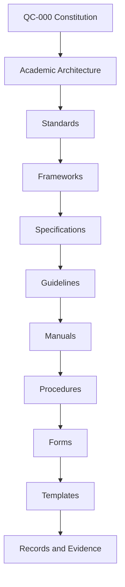
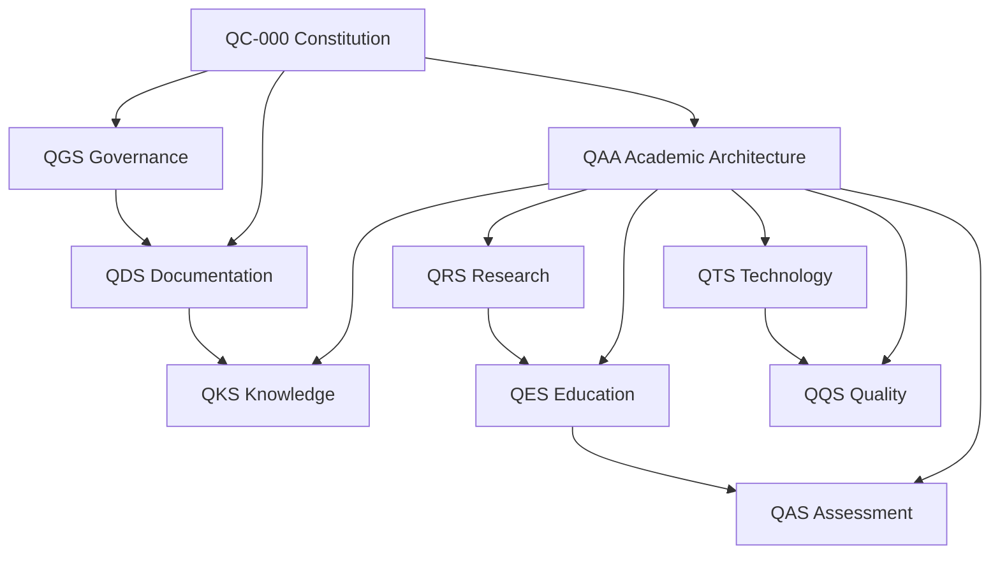

# QC-000 — QURBATA Constitution

**The Foundational Constitution of the QURBATA System**  
**الدستور التأسيسي لمنظومة قُرْبَة**  
**Konstitusi Dasar Sistem QURBATA**

---

## Document Control

| Field | Value |
|---|---|
| Document ID | QC-000 |
| Title | QURBATA Constitution |
| Version | 0.2.0 |
| Status | Founding Draft |
| Classification | Public Draft |
| Document Level | Constitutional |
| Governing Authority | Founder and QURBATA Constitution Council |
| Institutional Home | Rumah Ilmu Al-Qur'an (RIQA) |
| Official Languages | English, Arabic, Indonesian |
| Source Format | Markdown |
| Print Format | A4 PDF derived from this source |
| Effective Date | Upon ratification |
| Review Cycle | At least once every three years, or when materially required |

> **Normative note:** This Markdown file is the authoritative editable source for QC-000. Any PDF or printed edition must be generated from an approved version of this file and must display the same document ID, version, and status.

---

## Revision History

| Version | Date | Status | Summary |
|---|---|---|---|
| 0.1.0 | 2026 | Initial Draft | Preliminary identity, purpose, vision, mission, values, scope, and definitions |
| 0.2.0 | 2026 | Founding Draft | Complete constitutional rewrite covering identity, authority, governance, academic integrity, standards, amendment, ratification, and transition |

---

## Approval Record

| Role | Name | Decision | Date | Signature |
|---|---|---|---|---|
| Founder and Principal Researcher | Aris Liswanto, S.Pd., M.Pd. | Pending | — | — |
| Academic Reviewer | To be appointed | Pending | — | — |
| Arabic Language Reviewer | To be appointed | Pending | — | — |
| Documentation Reviewer | To be appointed | Pending | — | — |

---

# Preamble

## English

QURBATA is established as an integrated academic and educational system for the design, implementation, evaluation, documentation, and continuous improvement of Qur'anic education. It is founded upon Islamic ethical commitments, scholarly inquiry, responsible governance, verifiable evidence, and service to learners, teachers, institutions, and society.

This Constitution defines the identity, authority, principles, governance, document hierarchy, and amendment procedures of QURBATA. All standards, frameworks, curricula, books, assessments, technologies, research activities, and institutional implementations developed under the name of QURBATA shall conform to this Constitution.

## العربية

تُؤَسَّسُ منظومةُ قُرْبَة بوصفها منظومةً أكاديميةً وتربويةً متكاملةً لتصميم التعليم القرآني وتنفيذه وتقويمه وتوثيقه وتحسينه المستمر. وتقوم هذه المنظومة على القيم الإسلامية، والبحث العلمي، والحوكمة المسؤولة، والأدلة القابلة للتحقق، وخدمة المتعلمين والمعلمين والمؤسسات والمجتمع.

ويحدد هذا الدستور هويةَ قُرْبَة وسلطتها ومبادئها وحوكمتها وتسلسل وثائقها وإجراءات تعديلها. ويلتزم بهذا الدستور كل معيار وإطار ومنهج وكتاب وتقويم وتقنية وبحث وتطبيق مؤسسي يصدر باسم قُرْبَة.

## Bahasa Indonesia

QURBATA didirikan sebagai sistem akademik dan pendidikan terpadu untuk merancang, menerapkan, mengevaluasi, mendokumentasikan, dan menyempurnakan pendidikan Al-Qur'an secara berkelanjutan. Sistem ini dibangun di atas nilai-nilai Islam, penelitian ilmiah, tata kelola yang bertanggung jawab, bukti yang dapat diverifikasi, serta pengabdian kepada peserta didik, guru, lembaga, dan masyarakat.

Konstitusi ini menetapkan identitas, kewenangan, prinsip, tata kelola, hierarki dokumen, dan prosedur perubahan QURBATA. Seluruh standar, kerangka, kurikulum, buku, asesmen, teknologi, kegiatan penelitian, dan implementasi kelembagaan yang dikembangkan atas nama QURBATA wajib tunduk pada Konstitusi ini.

---

# Part I — Identity and Constitutional Purpose

## Article 1 — Official Identity

### 1.1 Official Name

The official name of the system is **QURBATA**.

Nama resmi sistem ini adalah **QURBATA**.

الاسم الرسمي للمنظومة هو **قُرْبَة**.

### 1.2 Working Academic Descriptor

Until an academically validated final descriptor is ratified, QURBATA shall use the following working descriptor:

- **English:** Integrated Qur'anic Education and Knowledge System
- **Arabic:** منظومة متكاملة للتعليم القرآني وإدارة المعرفة
- **Indonesian:** Sistem Terpadu Pendidikan Al-Qur'an dan Manajemen Pengetahuan

The descriptor is provisional and may be refined after literature review, expert validation, and terminological review without changing the official name QURBATA.

### 1.3 Institutional Home

The initial institutional home of QURBATA is **Rumah Ilmu Al-Qur'an (RIQA)**. RIQA serves as the founding environment, primary pilot site, and initial steward of QURBATA development.

The institutional home does not eliminate the possibility of future collaboration, adoption, licensing, or governance participation by other qualified institutions.

### 1.4 Founder and Principal Researcher

The Founder and Principal Researcher of QURBATA is **Aris Liswanto, S.Pd., M.Pd.**

The Founder holds the initial constitutional authority described in this document until governance responsibilities are formally delegated through ratified standards or council decisions.

### 1.5 Official Languages

The official documentary languages of QURBATA are:

1. English;
2. Arabic; and
3. Bahasa Indonesia.

The three languages are intended to serve complementary academic, Islamic scholarly, national, and international functions. Where wording differs materially, the discrepancy must be recorded and resolved through an approved language-review process. No translation may silently alter a normative requirement.

---

## Article 2 — Nature of QURBATA

### 2.1 System Character

QURBATA is not limited to a book, reading method, curriculum, application, or institutional program. It is an evolving academic and educational system that may include:

- constitutional and governance documents;
- academic and technical standards;
- educational frameworks and models;
- curricula and learning pathways;
- books and teaching resources;
- assessment instruments and rubrics;
- teacher-development systems;
- research protocols and evidence records;
- digital platforms, data systems, and analytics;
- quality-assurance mechanisms; and
- implementation guidance for institutions.

### 2.2 Development Character

QURBATA shall be developed progressively through documented inquiry, design, review, pilot implementation, evaluation, validation, revision, and controlled publication.

### 2.3 Non-Finality

No version of QURBATA shall be treated as perfect or immune from revision. Improvement is permitted and expected, but every material change must be traceable, justified, reviewed, and versioned.

---

## Article 3 — Constitutional Purpose

QURBATA exists to:

1. develop a coherent, research-informed system for Qur'anic education;
2. integrate Islamic values, educational science, Arabic and Qur'anic studies, assessment, technology, knowledge management, and quality assurance;
3. produce documented standards that can be implemented, evaluated, and improved;
4. support learners with diverse ages, abilities, backgrounds, and learning trajectories;
5. strengthen teacher competence, integrity, and professional growth;
6. produce valid, reliable, fair, and useful assessment practices;
7. connect educational practice with research and evidence;
8. preserve institutional knowledge and prevent the loss of concepts, decisions, and learning assets;
9. enable responsible digital transformation through RIQA OS and other approved technologies;
10. support scholarly publication, dissertation research, institutional learning, and public benefit; and
11. encourage national and international collaboration without compromising constitutional principles.

---

## Article 4 — Vision and Mission

### 4.1 Vision

**English**  
To become a trustworthy, integrated, research-informed system for the advancement of Qur'anic education through scholarly standards, responsible innovation, and continuous improvement.

**العربية**  
أن تصبح قُرْبَة منظومةً موثوقةً ومتكاملةً ومستندةً إلى البحث العلمي للارتقاء بالتعليم القرآني من خلال المعايير العلمية والابتكار المسؤول والتحسين المستمر.

**Bahasa Indonesia**  
Menjadi sistem pendidikan Al-Qur'an yang tepercaya, terpadu, dan berbasis penelitian melalui standar ilmiah, inovasi yang bertanggung jawab, serta perbaikan berkelanjutan.

### 4.2 Mission

QURBATA shall pursue its vision by:

1. establishing coherent constitutional, academic, governance, documentation, research, educational, technological, and quality standards;
2. conducting and supporting systematic research in Qur'anic education;
3. developing structured, cumulative, adaptive, and assessable curricula;
4. producing high-quality books, learning resources, and teacher guides;
5. developing teachers through defined competency pathways;
6. building transparent and useful learner-assessment systems;
7. integrating technology in ways that serve pedagogy rather than replace it;
8. maintaining repositories, registries, metadata, and revision histories;
9. encouraging scholarly critique, validation, and collaboration; and
10. translating findings from practice into improved standards and resources.

---

# Part II — Constitutional Principles

## Article 5 — Foundational Values

All QURBATA activities shall be guided by the following values.

### 5.1 Tawhid

All educational and scholarly work is ultimately oriented toward worship of Allah, ethical responsibility, and human benefit.

### 5.2 Ikhlas

Work shall be undertaken with sincere intention, while recognizing that sincerity does not remove the obligation to meet professional and academic standards.

### 5.3 Amanah

Data, references, decisions, finances, intellectual contributions, learner records, and institutional responsibilities shall be managed honestly and accountably.

### 5.4 Itqan

QURBATA shall pursue disciplined excellence, precision, care, and continual refinement in scholarship, teaching, design, and implementation.

### 5.5 'Adalah

Educational opportunities, assessment, treatment, and access shall be designed fairly, with reasonable attention to learner diversity and contextual needs.

### 5.6 Rahmah

Teaching, assessment, governance, and discipline shall preserve human dignity and promote compassionate educational relationships.

### 5.7 Syura

Material decisions should be informed by consultation with appropriate scholars, educators, researchers, practitioners, and affected stakeholders.

### 5.8 Academic Integrity

QURBATA prohibits fabrication, falsification, plagiarism, invented citations, deceptive authorship, and misrepresentation of evidence.

### 5.9 Evidence-Informed Development

Important decisions shall consider relevant evidence, while recognizing that evidence must be interpreted ethically and within the educational and Islamic context.

### 5.10 Traceability

Important concepts, requirements, revisions, evidence, and implementation decisions shall be documented so that their origin and impact can be examined.

### 5.11 Continuous Improvement

Standards and resources shall be evaluated and revised when credible evidence, implementation experience, or legitimate scholarly criticism indicates a need for improvement.

### 5.12 Sustainability

QURBATA shall seek institutional, intellectual, technological, operational, and financial continuity without sacrificing educational integrity.

---

## Article 6 — Academic and Scientific Commitments

### 6.1 Interdisciplinary Foundation

QURBATA may draw upon, among other relevant fields:

- Qur'anic studies;
- hadith and Islamic scholarship;
- Islamic education;
- Arabic language education;
- curriculum studies;
- learning sciences;
- developmental and educational psychology;
- assessment and measurement;
- teacher education;
- educational technology;
- knowledge management;
- quality management;
- research methodology; and
- information and data governance.

### 6.2 Source Integrity

Sources shall be selected, recorded, and represented accurately. Primary sources shall be preferred where appropriate. Secondary sources may be used when they provide legitimate interpretation, synthesis, critique, or contextualization.

### 6.3 Evidence Classification

QURBATA shall distinguish between:

1. normative Islamic foundations;
2. established scholarly knowledge;
3. theoretical propositions;
4. design assumptions;
5. expert judgments;
6. field observations;
7. pilot findings;
8. validated research findings; and
9. institutional policy decisions.

These categories shall not be presented as though they possess the same evidentiary status.

### 6.4 Claims and Originality

Claims of novelty, effectiveness, superiority, validity, or generalizability must be proportionate to available evidence. QURBATA shall not claim that a concept is original merely because it has not yet been located in an incomplete literature review.

### 6.5 Human and AI Contributions

Artificial intelligence may support drafting, analysis, language refinement, documentation, coding, and review. Human authors and authorities remain responsible for scholarly judgment, factual verification, ethical compliance, approval, implementation, and published claims.

AI-generated or AI-assisted content shall not be treated as verified merely because it is fluent or technically formatted.

---

# Part III — Scope and Authority

## Article 7 — Constitutional Scope

This Constitution governs all official QURBATA components, including:

1. governance and constitutional documents;
2. academic architecture;
3. standards and specifications;
4. knowledge registries and terminology;
5. research design and evidence management;
6. educational foundations and principles;
7. curricula, levels, pathways, and learning outcomes;
8. books, lessons, exercises, and media;
9. assessment, certification, and progression;
10. teacher competence and professional development;
11. quality assurance and audit;
12. data, software, automation, and educational technology;
13. institutional implementation and licensing;
14. publication, translation, and dissemination;
15. branding and use of the QURBATA name; and
16. archives, repositories, templates, and official records.

---

## Article 8 — Supremacy and Document Hierarchy

### 8.1 Constitutional Supremacy

QC-000 is the highest internal normative document of the QURBATA system. No subordinate document may contradict it.

### 8.2 Hierarchy

The default document hierarchy is:

1. Constitution;
2. Architecture;
3. Standards;
4. Frameworks;
5. Specifications;
6. Guidelines;
7. Manuals;
8. Standard Operating Procedures;
9. Forms;
10. Templates; and
11. Records and evidence.

### 8.3 Conflict Resolution

Where two documents conflict:

1. the higher-level document prevails;
2. where both have the same level, the more specific approved document prevails unless expressly superseded;
3. where uncertainty remains, the matter shall be referred to the competent governance authority; and
4. the conflict and its resolution shall be documented.

### 8.4 Subordinate Standards

The initial constitutional standard family may include:

- QAA — QURBATA Academic Architecture;
- QGS — QURBATA Governance Standard;
- QDS — QURBATA Documentation Standard;
- QKS — QURBATA Knowledge Standard;
- QRS — QURBATA Research Standard;
- QES — QURBATA Educational Standard;
- QAS — QURBATA Assessment Standard;
- QTS — QURBATA Technology Standard; and
- QQS — QURBATA Quality Standard.

The existence, identifier, title, or scope of a subordinate standard becomes official only after it is registered and approved under the applicable governance and documentation rules.

---

# Part IV — Governance

## Article 9 — Constitutional Authority

### 9.1 Initial Authority

During the founding stage, constitutional authority is held by the Founder and Principal Researcher.

### 9.2 Delegation

Authority may be delegated to councils, reviewers, editors, maintainers, research teams, or institutional units. Delegation must be documented and does not remove the Founder's responsibility for powers that have not been expressly transferred.

### 9.3 Limits of Authority

No authority may:

- conceal material conflicts of interest;
- approve fabricated or knowingly false evidence;
- erase authorship or contribution records without legitimate cause;
- bypass mandatory ethical review;
- alter approved documents without revision control; or
- use the QURBATA name in ways that materially misrepresent its status or findings.

---

## Article 10 — Constitution Council

### 10.1 Establishment

A QURBATA Constitution Council may be established to protect constitutional coherence, review major amendments, and oversee the integrity of the system's highest-level standards.

### 10.2 Initial Composition

During the founding stage, the Council may consist of:

- the Founder and Principal Researcher;
- appointed Qur'anic education experts;
- Islamic studies or Arabic experts;
- curriculum and learning experts;
- assessment and research experts;
- technology or data experts; and
- documentation or quality experts.

### 10.3 Competence-Based Participation

Membership shall be based on relevant competence, integrity, independence of judgment, and willingness to disclose conflicts of interest.

### 10.4 Responsibilities

The Council may:

1. review constitutional amendments;
2. advise on disputes between high-level standards;
3. approve or recommend rejection of architecture-freeze proposals;
4. commission expert and language reviews;
5. protect the distinction between validated findings and aspirational claims;
6. review major licensing or open-standard decisions; and
7. preserve continuity during leadership transitions.

### 10.5 Founding-Stage Safeguard

Until the Council is formally constituted and its procedure ratified, references to Council approval mean provisional review under the authority of the Founder.

---

## Article 11 — Roles and Responsibilities

### 11.1 Founder and Principal Researcher

The Founder shall:

- safeguard the mission and constitutional identity;
- approve founding-stage priorities;
- distinguish personal vision from validated scientific findings;
- ensure that research and implementation remain ethically responsible;
- authorize official releases; and
- initiate succession and continuity planning.

### 11.2 Document Owner

Each controlled document shall have an identified owner responsible for its accuracy, maintenance, review status, and relationship with other documents.

### 11.3 Author and Contributor

Authors and contributors shall be credited according to their actual contribution. Drafting support, translation, review, data collection, design, software development, and scholarly supervision should be distinguished where relevant.

### 11.4 Reviewer

A reviewer shall examine the content within the reviewer's declared area of competence and record approval, required revision, reservation, or rejection.

### 11.5 Implementing Institution

An implementing institution shall apply only the version and scope it is authorized to use, maintain implementation records, protect learner data, and avoid claims exceeding verified results.

### 11.6 Technology Maintainer

Technology maintainers shall protect system reliability, security, data integrity, access control, backups, version compatibility, and auditability.

---

## Article 12 — Decision-Making

### 12.1 Decision Classes

Decisions shall be classified at minimum as:

- constitutional;
- strategic;
- normative standard;
- academic or research;
- technical;
- operational; or
- editorial.

### 12.2 Proportional Review

The level of review shall be proportional to the importance, risk, reversibility, and system-wide impact of the decision.

### 12.3 Evidence and Rationale

Material decisions must record:

- the issue being decided;
- the available evidence;
- alternatives considered;
- risks and expected consequences;
- responsible authority;
- decision date;
- implementation requirements; and
- review conditions.

### 12.4 Urgent Decisions

Urgent decisions may be made when delay would create significant educational, ethical, legal, security, or operational harm. Such decisions must be documented and reviewed after the urgent condition has passed.

---

# Part V — Research, Ethics, and Evidence

## Article 13 — Research Policy

### 13.1 Research Cycle

QURBATA shall encourage a documented lifecycle that may include:

idea → observation → literature review → theoretical synthesis → design → pilot implementation → data collection → analysis → validation → standardization → dissemination → continuous improvement.

### 13.2 Research Independence

Researchers shall be permitted to report findings that do not support expected outcomes. Negative, mixed, or inconclusive findings shall not be concealed merely to protect reputation or product development.

### 13.3 Validation

Educational claims intended for broad use should undergo appropriate validation, which may include expert review, content validation, pilot testing, reliability analysis, learner-outcome evaluation, usability testing, and contextual replication.

### 13.4 Research Records

Research protocols, instruments, consent materials, data-management plans, analyses, decisions, and limitations shall be retained according to the applicable research and data standards.

---

## Article 14 — Ethics and Protection

### 14.1 Human Dignity

All QURBATA activities shall respect human dignity and avoid humiliation, coercion, exploitation, discrimination, and abusive educational practices.

### 14.2 Children and Vulnerable Participants

Research and implementation involving children or vulnerable participants require heightened protection, appropriate permission or consent, privacy safeguards, and age-appropriate communication.

### 14.3 Privacy and Data Minimization

Only data necessary for legitimate educational, administrative, research, or quality purposes should be collected. Access shall be limited and recorded according to role and need.

### 14.4 Conflict of Interest

Financial, institutional, personal, academic, or commercial interests that could influence judgment shall be disclosed and managed.

### 14.5 Intellectual Property and Traditional Knowledge

QURBATA shall respect copyright, licensing terms, authorship, scholarly traditions, community contributions, and the integrity of Islamic source materials.

---

## Article 15 — Reference and Publication Integrity

### 15.1 Verifiability

References must be real, traceable, and accurately represented. Invented books, articles, quotations, page numbers, publication data, and digital object identifiers are prohibited.

### 15.2 Citation Style

APA 7 shall be the default style for modern academic references unless a document standard authorizes a more appropriate discipline-specific system. Qur'anic verses, hadith, classical Arabic works, and Islamic sources may use specialized conventions defined in QDS and QRS.

### 15.3 Publication Status

Documents shall clearly state whether they are conceptual drafts, working drafts, reviewed drafts, candidate standards, approved standards, superseded documents, or archived records.

### 15.4 Correction

Material errors discovered after publication shall be corrected transparently through errata, revision, withdrawal, or supersession, according to severity.

---

# Part VI — Documentation and Knowledge Integrity

## Article 16 — Controlled Documentation

Every controlled document shall contain, as applicable:

- a unique document identifier;
- title;
- version;
- status;
- owner;
- language status;
- approval record;
- revision history;
- scope;
- normative and informative sections;
- related documents;
- references; and
- archival status.

Detailed requirements shall be defined in QDS.

---

## Article 17 — Repository and Single Source of Truth

### 17.1 Authoritative Source

The designated GitHub repository shall serve as the primary version-controlled source for approved Markdown documents, supporting assets, registries, and revision history, subject to backup and access-control requirements.

### 17.2 Derived Outputs

PDF, print, website, presentation, application, and other published forms are derived outputs unless expressly designated otherwise.

### 17.3 No Silent Editing

An approved document shall not be altered outside the controlled workflow and then represented as the same approved version.

### 17.4 Preservation

Superseded and withdrawn documents shall be archived rather than silently deleted when their retention is necessary for scholarly, legal, historical, or audit purposes.

---

## Article 18 — Knowledge Registry and Traceability

QURBATA may maintain controlled registries for:

- documents;
- knowledge concepts;
- terminology;
- references;
- figures and tables;
- curriculum elements;
- assessment items;
- books and learning resources;
- research projects; and
- software components.

Registry identifiers shall be persistent, unique within their namespace, and governed by QKS and QDS. An identifier shall not be reused for a different object after retirement.

---

# Part VII — Education, Assessment, and Technology

## Article 19 — Educational Design

QURBATA educational design shall:

1. define intended learners and contexts;
2. specify learning outcomes and progression;
3. apply gradual, cumulative, and coherent sequencing;
4. align instruction, practice, assessment, and remediation;
5. consider learner diversity and accessibility;
6. protect Qur'anic accuracy and adab;
7. document assumptions and limitations; and
8. permit revision in response to validated evidence.

---

## Article 20 — Assessment

Assessment shall be designed to be as valid, reliable, fair, transparent, and educationally useful as reasonably possible for its intended purpose.

High-stakes decisions shall not rely on an instrument whose purpose, scoring rule, quality, or limitations are undocumented.

Learners should receive appropriate feedback, opportunities for improvement, and protection against arbitrary or humiliating assessment practices.

---

## Article 21 — Teachers

Teachers are not merely delivery agents. QURBATA shall recognize teachers as educators, models of adab, assessors, reflective practitioners, and contributors to improvement.

Teacher responsibilities, competency levels, certification, supervision, professional development, and ethical expectations shall be defined in controlled standards and implementation documents.

---

## Article 22 — Technology and RIQA OS

### 22.1 Pedagogical Service

Technology shall serve legitimate educational and institutional purposes. It shall not be adopted merely because it is novel.

### 22.2 Human Oversight

Automated recommendations, scores, classifications, or communications that materially affect learners or teachers shall remain subject to appropriate human oversight.

### 22.3 Data Integrity

RIQA OS and other approved systems shall preserve data accuracy, access control, traceability, privacy, backup, and recoverability.

### 22.4 Interoperability

Where practical, digital systems should use documented structures and identifiers so that curriculum, books, assessment, learner progress, and research data can be linked without creating uncontrolled duplication.

---

# Part VIII — Quality, Implementation, and Public Use

## Article 23 — Quality Assurance

Quality assurance shall include appropriate combinations of:

- document review;
- language review;
- scholarly review;
- technical verification;
- pilot implementation;
- data-quality checks;
- user feedback;
- audit;
- corrective action; and
- periodic revalidation.

Quality shall not be inferred solely from appearance, popularity, institutional authority, or technological sophistication.

---

## Article 24 — Implementation and Conformance

### 24.1 Levels of Use

An institution or product may describe its relationship to QURBATA only using an approved status, such as:

- informed by QURBATA;
- pilot implementation;
- partial conformance;
- full conformance; or
- certified implementation.

The criteria for each status shall be defined in an approved quality or licensing standard.

### 24.2 No Misrepresentation

No party may claim official certification, research validation, or full compliance without the required evidence and authorization.

### 24.3 Contextual Adaptation

Adaptation is permitted when needed for context, but material changes must be documented. An adapted product shall not be represented as identical to the approved source.

---

## Article 25 — Openness, Licensing, and Collaboration

### 25.1 Open-Standard Aspiration

QURBATA may develop toward an open-standard model that permits reading, critique, contribution, and responsible implementation.

### 25.2 License Separation

Documentation, software, data, trademarks, images, assessment materials, and commercial learning products may require different licenses. No license shall be assumed merely because a file is visible in a public repository.

### 25.3 Trademark and Name Protection

The QURBATA name and identity may be protected to prevent misleading, harmful, or unauthorized claims while preserving legitimate scholarly discussion and citation.

### 25.4 Collaboration

Collaboration shall preserve academic independence, contribution records, ethical requirements, and transparency regarding funding or institutional interests.

---

# Part IX — Amendment, Ratification, and Continuity

## Article 26 — Amendment

### 26.1 Amendment Proposal

A constitutional amendment proposal must include:

1. the provision to be changed;
2. the proposed wording;
3. the reason for change;
4. supporting evidence or rationale;
5. affected documents and systems;
6. transition requirements;
7. known risks; and
8. proposer identity and date.

### 26.2 Review

A material amendment shall receive constitutional, academic, documentation, and language review appropriate to its scope.

### 26.3 Approval

During the founding stage, amendments require approval by the Founder. After a Constitution Council is formally established, the ratified governance standard shall define voting, quorum, reservation, veto, and appeal procedures.

### 26.4 Versioning

Editorial corrections may increment the patch version. Material additions or changes normally increment the minor version. Changes that fundamentally alter constitutional identity, authority, or system structure require a major-version proposal.

### 26.5 Record Preservation

Every approved or rejected amendment proposal shall be retained with its decision and rationale.

---

## Article 27 — Ratification and Effective Date

### 27.1 Founding Draft Status

Version 0.2.0 is a **Founding Draft**. It is not yet a fully ratified constitution.

### 27.2 Conditions for Ratification

Ratification should occur only after:

- complete content review;
- consistency review with the repository architecture;
- English review;
- Arabic scholarly-language review;
- Indonesian review;
- confirmation of document identifiers and hierarchy;
- approval by the Founder; and
- completion of the approval record.

### 27.3 Effective Date

The Constitution becomes effective on the date recorded in the approved ratification statement.

---

## Article 28 — Transition and Continuity

### 28.1 Existing Documents

Documents created before ratification shall be reviewed and classified as:

- conforming;
- requiring revision;
- provisional;
- superseded; or
- archived.

### 28.2 Architecture Freeze

An Architecture Freeze is a controlled baseline, not a permanent prohibition on change. It indicates that the approved architecture is stable enough for dependent development and may be changed only through documented review.

### 28.3 Succession

QURBATA shall develop succession, stewardship, backup, and continuity provisions so that the system does not depend entirely on one person, one device, one platform, or one institution.

### 28.4 Institutional Continuity

If the founding institution changes structure or ceases operation, the QURBATA archive, authorship record, research evidence, and controlled documents shall be preserved and transferred according to a documented continuity decision.

---

# Appendices

## Appendix A — Normative Terms

| Term | Meaning |
|---|---|
| Shall / wajib | Mandatory requirement |
| Shall not / dilarang | Prohibition |
| Should / sebaiknya | Recommended practice; deviation requires reasonable justification |
| May / dapat | Permitted option |
| Normative | Establishes requirements or prohibitions |
| Informative | Provides explanation, context, or example without creating a requirement |

## Appendix B — Core Definitions

| Term | Definition |
|---|---|
| Constitution | Highest internal normative document defining QURBATA's identity, authority, principles, and amendment rules |
| Architecture | Approved structure describing major components and their relationships |
| Standard | Controlled normative document establishing requirements |
| Framework | Structured conceptual arrangement connecting principles, components, or processes |
| Specification | Detailed technical or functional requirements for a defined object or system |
| Guideline | Recommended approach that supports implementation without always being mandatory |
| Manual | Instructional document explaining how to perform a defined function |
| Procedure | Ordered operational steps with assigned responsibilities and controls |
| Evidence | Information used to support, question, or evaluate a claim or decision |
| Validation | Process of determining whether an object is suitable for its intended purpose |
| Verification | Process of checking whether specified requirements have been met |
| Knowledge Asset | Identifiable, documented knowledge maintained within the QURBATA system |
| Controlled Document | Document subject to identification, versioning, review, approval, distribution, and archival controls |
| Ratification | Formal approval that grants constitutional or normative effect |
| Conformance | Demonstrated fulfillment of applicable requirements |

## Appendix C — Constitutional Hierarchy

## Appendix D — Initial Standard Family

## Appendix E — Founding Ratification Statement

> We, the undersigned authority and appointed reviewers, having examined the identity, purpose, principles, governance, academic commitments, document hierarchy, amendment rules, and continuity provisions of QURBATA, hereby ratify QC-000 as the Constitution of the QURBATA system, effective on the date stated below.

| Role | Name | Signature | Date |
|---|---|---|---|
| Founder and Principal Researcher | Aris Liswanto, S.Pd., M.Pd. | — | — |
| Constitutional Reviewer | — | — | — |
| Academic Reviewer | — | — | — |
| Arabic Language Reviewer | — | — | — |
| Documentation Reviewer | — | — | — |

---

## Status Notice

**QC-000 v0.2.0 remains a Founding Draft until the approval record and ratification statement are completed.**

The next controlled review shall focus on:

1. full trilingual equivalence;
2. Arabic academic-language validation;
3. alignment with QAA, QGS, and QDS;
4. verified scholarly and Islamic references;
5. licensing and intellectual-property policy; and
6. print-ready formatting and PDF generation.
